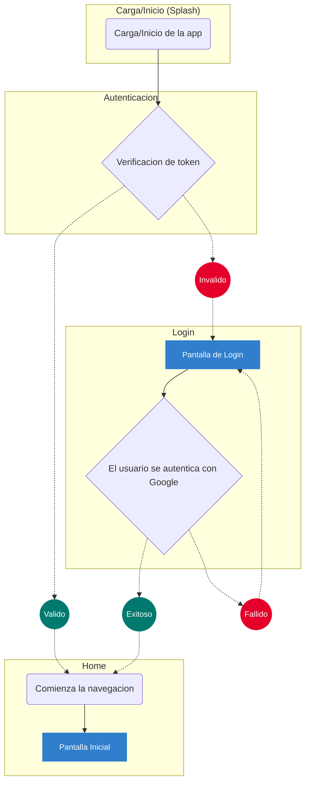

# Proyecto Crypto App

El proyecto posee el siguiente stack tecnologico

- [React-Native](https://reactnative.dev/architecture/landing-page)
- Navegabilidad/Ruteo lo que le permite manejar distintas pilas de pantallas, navegar entre ellas y bloquear algunas segun se necesite, para ello se utilizo [React-Navigation](https://reactnavigation.org/)
- Autenticación mediante el metodo OAuth contra google permitiendo configurar y eliminar quienes seran los usuarios con acceso a la app, utilizando un wrapper que posee las funcionalidades de google [Google-SignIn](https://react-native-google-signin.github.io/docs/install)
- Manejo de estados de la app para guardar las acciones del usuario, se ha implementado como middleware Thunk, mediante la famosa libreria [Redux](https://redux.js.org/introduction/installation)
- Persistencia de los datos sencibles y/o core de la app como pueden serlo autenticacion, datos ingresados en formularios etc, en este caso con muy buena compatibilidad con redux se ha usado [Async-Storage](https://react-native-async-storage.github.io/async-storage/docs/install/)
- Invocacion a la api que nos provee los datos necesarios sobre el estado, cotizacion y demas, mediante la libreria [Axios](https://axios-http.com/es/docs/intro)

### Requisitos

- [x] [Java SDK](https://openjdk.org/projects/jdk/17/)
- [x] [Android Studio](https://developer.android.com/studio?hl=es-419)
- [x] Variables de ambiente seteadas: *ANDROID_HOME*, *JAVA_HOME*

### Instalación

**1.** Instalar la SDK de Java (por tema Kotlin)

**2.** Configurar las variables de ambiente segun lo indica la [documentación](https://reactnative.dev/docs/set-up-your-environment?os=windows)

- *ANDROID_HOME*: "%LOCALAPPDATA%\Android\Sdk"
- *JAVA_HOME*: "alguna-version/java/jdk-11+/"
- *PATH*: agregar a la lista "%LOCALAPPDATA%\Android\Sdk\platform-tools"

**3.A** Android:
correr los siguientes comandos
```powershell
yarn run ad-run // builder la app en modo local
yarn run ad-start // en caso de que se cierre en bundler
```

**3.B** IOS:
correr los siguientes comandos
```powershell
yarn run ios-start // para instalar los pods
yarn run ios-run // builder la app en modo local
```

### Flujo de Autenticación


