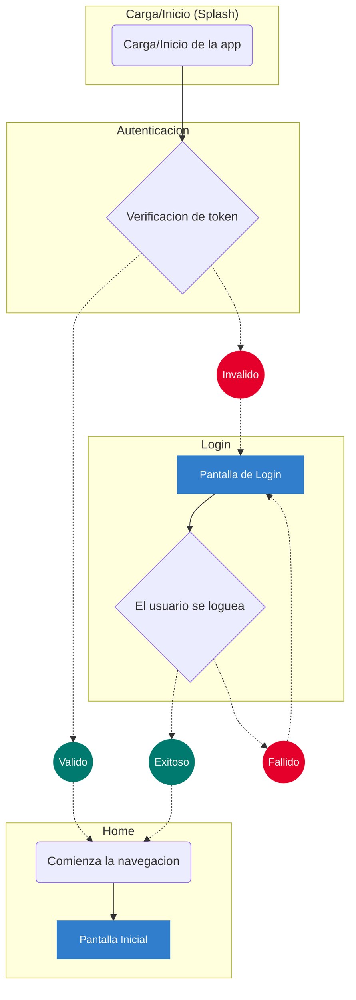

# Proyecto Crypto App

## Flujo de Autenticación

```mermaid
graph TD;

  NodeAuth1 -.-> NodeAuthSuccess((Valido)) -.-> NodeHome1
  NodeAuth1 -.-> NodeAuthFail((Invalido)) -.-> NodeLogin1
  NodeLogin2 -.-> NodeLoginSuccess((Exitoso)) -.-> NodeHome1
  NodeLogin2 -.-> NodeLoginFail((Fallido)) -.-> NodeLogin1

  subgraph "Home"
  NodeHome1(Comienza la navegacion)
  NodeHome1 --> NodeHome2
  NodeHome2[Pantalla Inicial]
  end

  subgraph "Login"
  NodeLogin1 --> NodeLogin2
  NodeLogin1[Pantalla de Login]
  NodeLogin2{El usuario se loguea}
  end

  subgraph "Autenticacion"
  NodeAuth1{Verificacion de token}
  end

  subgraph "Carga/Inicio (Splash)"
  NodeSplash1(Carga/Inicio de la app)
  NodeSplash1 --> NodeAuth1
  end

  classDef clsSuccess font-size:14px,color:#FFF,fill:#007A6E,stroke:#007A6E,stroke-width:0px
  classDef clsError font-size:14px,color:#FFF,fill:#E4002B,stroke:#E4002B,stroke-width:0px
  classDef clsScreen font-size:14px,color:#FFF,fill:#307ecc,stroke:#307ecc,stroke-width:0px
  class NodeAuthFail,NodeLoginFail clsError
  class NodeAuthSuccess,NodeLoginSuccess clsSuccess
  class NodeLogin1,NodeHome2 clsScreen
  
```